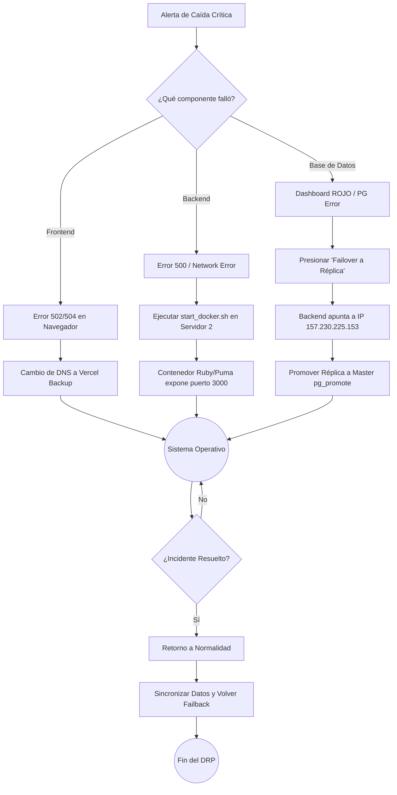
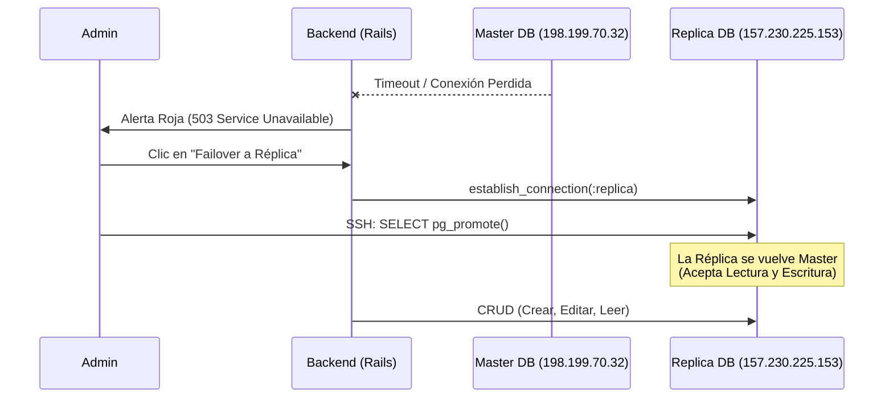

# 🛡️ DRP - Plan de Recuperación ante Desastres (ERP CAT)
**Versión del Documento:** 2.1.0 | **Clasificación:** Confidencial | **Última Actualización:** Julio 2026

Este documento constituye el **Disaster Recovery Plan (DRP)** oficial para la infraestructura del sistema ERP CAT. Define los protocolos estandarizados de respuesta rápida (Runbooks) ante fallas críticas en la arquitectura de alta disponibilidad, garantizando la continuidad del negocio.

---

## 📑 1. Acuerdos de Nivel de Servicio y Métricas Objetivo

Para cumplir con los estándares corporativos, todas las contingencias deben resolverse apuntando a las siguientes métricas:
- **SLA (Service Level Agreement):** 99.9% de disponibilidad (Uptime).
- **RTO (Recovery Time Objective):** Máximo 5 minutos de inactividad permitida tras un incidente crítico.
- **RPO (Recovery Point Objective):** Cero pérdida de datos (0 minutos), garantizado mediante replicación asíncrona (Streaming Replication) y Failback Sync.

---

## 🚦 2. Matriz de Triaje y Escalabilidad (Incident Command)

Identifique el componente afectado y asigne el nivel de severidad correspondiente. Todas las acciones de nivel "Crítico" deben ser reportadas al *Incident Commander* (Líder Técnico) inmediatamente.

| Tipo de Caída | Síntoma Principal (Monitoreo) | Nivel de Severidad | Acción de Contención Inmediata |
| :--- | :--- | :---: | :--- |
| **A. Frontend** | La URL principal arroja Error 502/504 o pantalla en blanco (Caída de Vercel). | 🟠 Nivel 2 (Alta) | Conmutación de DNS (Switch to Backup Vercel). |
| **B. Backend** | API inalcanzable. Interfaz muestra Error 500 constante o `Network Error`. | 🔴 Nivel 1 (Crítica)| Contenerización Docker en Servidor Limpio (Cold Standby). |
| **C. Base de Datos** | Alerta en Dashboard: "Base de Datos Desconectada". Fallo de conexión PG. | 🔴 Nivel 1 (Crítica)| Failover Dinámico a Servidor de Réplica (Hot Standby). |

---

## 🗺️ Diagrama de Flujo Global de Recuperación

El siguiente diagrama ilustra el proceso de toma de decisiones y el enrutamiento del tráfico en caso de un desastre.



---

## 🖥️ 3. Protocolo A: Caída de Capa de Presentación (Frontend)

**Escenario:** El servidor edge de Vercel que aloja la aplicación React (Single Page Application) ha colapsado o la zona DNS está inaccesible.
**Arquitectura de Respaldo:** Servidor secundario pre-desplegado en clúster alterno.

### Flujo de Resolución:
1. Ingrese a la consola del proveedor de Dominio (ej. Namecheap / Cloudflare).
2. Diríjase a **Advanced DNS** -> **Host Records**.
3. Localice el registro `CNAME` que apunta a `cname.vercel-dns.com`.
4. **Modifique el valor** apuntando hacia el subdominio de emergencia (ej. `erp-cat-backup.vercel.app`).
5. Reduzca el TTL (Time To Live) a 1 minuto para forzar la propagación global rápida.
6. Vacíe la caché local (`ipconfig /flushdns` o equivalente) para probar el acceso.

---

## ⚙️ 4. Protocolo B: Caída de Capa de Negocio (Backend API)

**Escenario:** El Servidor Principal (`198.199.70.32`) sufre un fallo de hardware (kernel panic, disco dañado) o el entorno Ruby se corrompe irremediablemente. La Base de Datos está intacta, pero no hay API para acceder a ella.

### Flujo de Resolución (Aprovisionamiento Dockerizado):
1. **Acceso de Emergencia:** Conéctese vía SSH al servidor de rescate (o al servidor 2 de BD).
   ```bash
   ssh root@157.230.225.153
   ```
2. **Posicionamiento en Repositorio:**
   ```bash
   cd ~/integrador/back_cat_erp
   ```
3. **Ejecución del Script de Contenerización (Runbook Automatizado):**
   ```bash
   ./start_docker.sh
   ```
   *¿Qué hace este script a nivel de infraestructura?*
   - Ejecuta `docker-compose down` para limpiar contenedores huérfanos de despliegues previos.
   - Compila una nueva imagen basada en `ruby:3.3.3` (Alpine/Debian), instalando dependencias del sistema operativo (libpq-dev, imagemagick).
   - Realiza un `bundle install` encapsulado.
   - Levanta el servidor Puma en modo *daemon* (`-d`) expuesto en el puerto 3000.
4. **Verificación de Salud:** Confirme conectividad consultando el endpoint de telemetría:
   ```bash
   curl -I http://localhost:3000/api/v1/health
   ```

---

## 💾 5. Protocolo C: Caída de Capa de Persistencia (Base de Datos)

**Escenario:** El clúster maestro PostgreSQL ha dejado de operar. Se requiere migrar el tráfico hacia la Base de Datos de Réplica (Read-Replica) sin interrumpir el trabajo de los usuarios.

### 5.1. Recuperación Inmediata (Failover Dinámico)



1. **Activar Redirección:** Desde un equipo seguro, ingrese a la ruta oculta `/admin/monitoring` del ERP.
2. Identifique el estado crítico (indicador ROJO) y presione el botón **"Restaurar (Failover a Réplica)"**.
3. **Promover la Réplica (Ascenso a Master):** En la consola SSH del Servidor 2 (Réplica), ejecute:
   ```bash
   sudo -u postgres psql -c "SELECT pg_promote();"
   ```
   > **IMPORTANTE:** Este comando rompe la replicación unidireccional y habilita los permisos de Escritura (`INSERT`, `UPDATE`, `DELETE`), permitiendo que el negocio continúe operando normalmente.

### 5.2. Retorno a Producción (Failback y Consistencia de Datos)
Una vez que el servidor original haya sido reiniciado o reparado por el equipo de DevOps:
1. Retorne al Panel de Monitoreo (`/admin/monitoring`).
2. Presione el botón **"Sincronizar Datos y Volver"**.
3. **Proceso Subyacente del Script de Failback:**
   - El sistema congelará temporalmente nuevas peticiones.
   - Leerá la memoria RAM y conectará simultáneamente a ambas bases de datos.
   - Escaneará tablas críticas y polimórficas (Roles, `User`, `Client`, `Lead`, `Quotation`, y todos los historiales de solicitudes `*Request`).
   - Sincronizará las **creaciones** (datos nuevos) y las **ediciones** (datos con un `updated_at` más reciente).
   - Reestablecerá el puntero global del ActiveRecord hacia el entorno `production`.
4. El sistema volverá a la normalidad en el Servidor 1 sin pérdida de consistencia.

### 5.3. Reconstrucción de la Réplica (Post-Incidente DevOps)
Dado que el comando `pg_promote()` cortó el enlace de replicación para permitir la escritura durante la emergencia, es OBLIGATORIO que el equipo de Infraestructura reconstruya la réplica para estar preparados ante un futuro desastre.

1. Traslade el script `rebuild_replica.sh` al Servidor 2 (Réplica).
2. Ejecútelo con privilegios de administrador:
   ```bash
   chmod +x rebuild_replica.sh
   ./rebuild_replica.sh
   ```
3. El script purgará la base de datos huérfana, descargará la versión más reciente desde el Servidor 1 mediante `pg_basebackup`, y reconectará el servidor como esclavo automáticamente.

---
**Fin del Documento.** *Imprimir y resguardar copia física en el Centro de Operaciones (NOC).*
